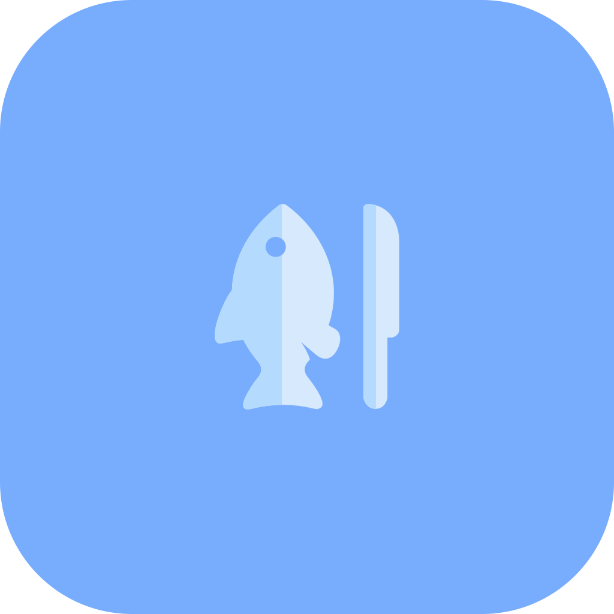
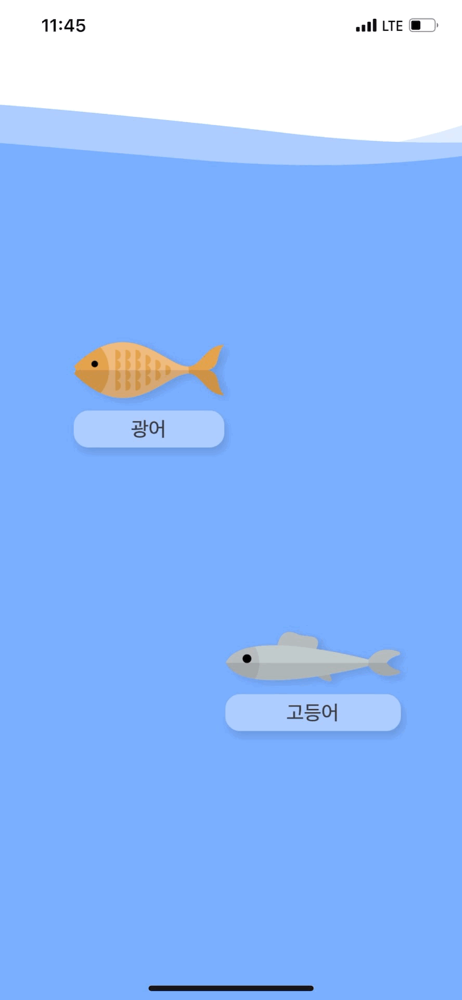

<h1 align="center">
     Clean Fish
</h1>

[![Swift Version][swift-image]](https://swift.org/)
[![Xcode Version][Xcode-image]](https://developer.apple.com/kr/xcode/)
[![Platform][Platform-image]](https://developer.apple.com/kr/ios/)
![Version][Version-image]

[swift-image]:https://img.shields.io/badge/Swift-5.6-orange?style=flat
[Xcode-image]: https://img.shields.io/badge/Xcode-13.3-blue?style=flat
[Platform-image]: https://img.shields.io/badge/iOS-15.0+-blue?style=flat
[Version-image]: https://img.shields.io/badge/Version-MVP-83ACF7.svg?style=flat


## 프로젝트 기간: 2022. 05. 10. ~ 2022. 06. 22.

<br>
<br>

## App View
||||
|:-:|:-:|:-:|
|`생선 선택`|`손질 방법 선택`|`손질 단계`|


<br>
<br>

# RnB Team Member

<div align = "center">

|||||||
|:-:|:-:|:-:|:-:|:-:|:-:|
|||||||
|Ground|Haru|Monica|Rey|Simon|Siro|
    
</div>

<br>

# Back Log
[Notion Backlog Page](https://autumn-discovery-349.notion.site/to-do-list-80c574ef970b435e84a7f04752c861f4)

<br>
<br>

## Project Challenge
---
> ## **"초보자를 도와주며 함께 성장하자"**
<br>

## Project Motto
---
> ## **"배워서 남주자"**
<br>


# Dependency
<table width=100%>
    <thead>
        <tr>
            <th><strong>Manager</strong></th>
            <th><strong>Dependecy</strong></th>
            <th><strong>Version</strong></th>
        </tr>
    </thead>
    <tbody>
        <tr>
            <td rowspan="11">SPM</td>
            <td>Lottie</td>
            <td>3.3.0</td>
        </tr>
        </tbody>
</table>

<br>

# Git convention

### Git branching Strategy
- Branch
    - main
    - Dev
    - Name/Task

- Label
    - feat
    - fix
    - bug
    - documentation
    - question

<br>


## Gitattributes
``` yaml
# .gitattributes
*.pbxproj binary merge=union
```

## Gitignore
``` yaml
# .gitignore
xcuserdata/ 
.DS_Store
```

<br>

# Code convention
``` yml
# .swiftlint.yml

excluded:
# SPM
  - .build

disabled_rules:
  - vertical_whitespace
  - trailing_whitespace
  - trailing_newline
  - shorthand_operator
```